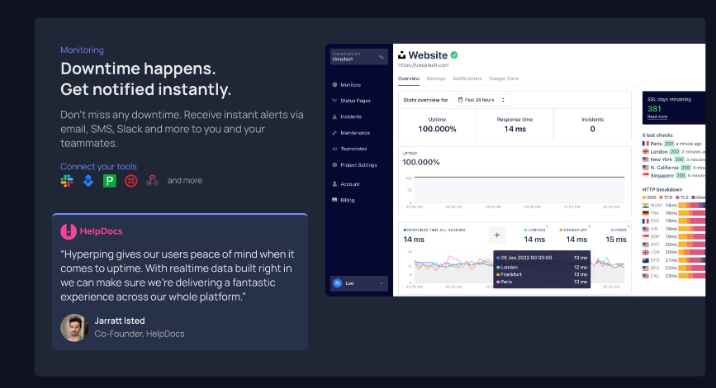

# Fonts

Found in [fontjoy.com](https://fontjoy.com/)

title: 
  [Montserrat Alternates](https://fonts.google.com/specimen/Montserrat+Alternates)

Sub-Title: 
  [Goudy Bookletter 1911](https://fonts.google.com/specimen/Goudy+Bookletter+1911)

Body:
  [Kanit](https://fonts.google.com/specimen/Kanit) 

# Sections

- [x] Información sobre el servicio
- [x] Características
- [x] Beneficios
- [x] Proceso de trabajo
- [ ] Trabajos
- [ ] Precios
- [ ] Contacto

---
1. Información sobre el servicio de creación de páginas web:
   - Descripción detallada de los servicios que ofreces, incluyendo el proceso de creación de páginas web, los tipos de sitios web que puedes construir, y cualquier tecnología o plataforma específica que utilices.
    - Ofrecemos servicios de diseño atractivo y desarrollo de sitios web totalmente personalizados para pequeñas empresas y emprendedores.
      Utilizamos las últimas tecnologías y tendencias de diseño para crear sitios web atractivos y funcionales que ayuden a nuestros clientes a alcanzar sus objetivos en línea.
    - Descipción de una imagen: 
      - Una imagen de un diseñador trabajando en una computadora portátil, creando un diseño web moderno y atractivo.

2. Portafolio de trabajos anteriores:
   - Muestra ejemplos de sitios web que has creado anteriormente para que los visitantes puedan ver tu trabajo y evaluar tu estilo y calidad.
     - [Construfijaciones](https://construfijaciones.com): Sitio web de una empresa de reparación y mantenimiento de herramienta eléctrica DeWalt, Black & Decker, Stanley y Craftsman. Se utilizo un diseño limpio y profesional para reflejar la seriedad y confiabilidad de la empresa.
      Tecnologías utilizadas: Astro, React, Tailwind CSS
      Comentarios: Roberto Flores, dueño y fundador de Construfijaciones
     - [Native Wine](https://native-wine.vercel.app): Esta pagina web fue creada con el fin de promocionar un vino artesanal de El Salvador, se utilizo un diseño minimalista y elegante para resaltar la calidad del producto.
      Tecnologías utilizadas: Astro, Tailwind CSS
     - Ejemplo de como integrarlos:
      

3. Información sobre el equipo:
   - Presenta al equipo detrás del servicio, incluyendo información sobre la experiencia y las habilidades de cada miembro clave.
     Mauricio Martínez, Estudiante de Ing. en ciencias de la computación: Diseñador y desarrollador web con experiencia en la creación de sitios web atractivos y funcionales para pequeñas empresas y emprendedores.

4. Proceso de trabajo:
   - Detalla cómo funciona el proceso de trabajo con tu servicio, desde la consulta inicial hasta la entrega final del sitio web.
      1. Consulta inicial: Nos reunimos con el cliente para discutir sus necesidades y objetivos, y para obtener una comprensión clara de lo que están buscando en su sitio web.
      2. Diseño y desarrollo: Creamos un diseño personalizado basado en las especificaciones del cliente y lo desarrollamos utilizando las últimas tecnologías y tendencias de diseño.
      3. Revisión y ajustes: Presentamos el diseño al cliente para su revisión y realizamos cualquier ajuste necesario para garantizar que estén satisfechos con el resultado final.
      4. Entrega y soporte: Una vez que el sitio web esté completo y aprobado por el cliente, lo entregamos y proporcionamos soporte continuo para cualquier pregunta o problema que puedan surgir.

5. Precios y planes:
   - Si es relevante, proporciona información sobre los precios de tus servicios y los diferentes planes que ofreces.
     1. Plan básico: Incluye diseño y desarrollo de un sitio web estático de una sola página por $120. Mensualidad de $20 para mantenimiento y soporte.
     2. Plan estándar: Incluye diseño y desarrollo de un sitio web de varias páginas por $300.  Mensualidad de $30 para mantenimiento y soporte.
     3. Plan premium: Incluye diseño y desarrollo de un sitio web de comercio electrónico por $700. Mensualidad de $50 para mantenimiento y soporte.
     4. Personalizado: Ofrecemos servicios personalizados para proyectos más grandes o complejos, con precios basados en las necesidades específicas del cliente. 
    
    Todos los planes incluyen:
      - Diseño personalizado
      - Desarrollo de sitios web
      - Optimización para dispositivos móviles
      - Soporte técnico
      - Integración con redes sociales
      - SEO básico
      - Hosting y dominio

6. Formulario de contacto:
   - Incluye un formulario de contacto para que los visitantes puedan comunicarse contigo directamente para hacer consultas o solicitar cotizaciones.

7. Preguntas frecuentes (FAQ):
   - Anticipa las preguntas comunes que puedan tener los visitantes y proporciona respuestas claras y concisas.
      - ¿Cuánto tiempo se tarda en crear un sitio web?
        El tiempo de creación de un sitio web varía según la complejidad del proyecto y la cantidad de páginas y características que se requieran. En general, un sitio web básico puede tardar de 2 a 6 semanas en completarse, mientras que un sitio web más complejo puede tardar de 6 a 10 semanas. Esto después de brindada toda la información necesaria.
      - ¿Qué información necesitas de mí para crear mi sitio web?
        Necesitamos información detallada sobre su empresa, incluyendo su logotipo, colores corporativos, imágenes y texto que desea incluir en el sitio web. También necesitamos una descripción clara de sus objetivos y necesidades para el sitio web.
      - ¿Ofrecen servicios de mantenimiento y soporte?
        Sí, ofrecemos servicios de mantenimiento y soporte para todos los sitios web que creamos. Nuestros planes de mantenimiento incluyen actualizaciones regulares, copias de seguridad, soporte técnico y asistencia con cualquier problema que pueda surgir.
      - ¿Puedo actualizar mi sitio web yo mismo?
        No, por el momento no ofrecemos la opción de que los clientes actualicen sus sitios web por sí mismos. Sin embargo, estamos disponibles para realizar cualquier actualización o cambio que necesite en su sitio web. Esto si son pequeños cambios, si son cambios grandes se cobrará un costo adicional.
      - ¿Qué tecnologías utilizan para crear sitios web?
        Utilizamos una variedad de tecnologías y herramientas para crear sitios web, incluyendo HTML, CSS, JavaScript, React, Astro, Tailwind CSS, entre otras. Seleccionamos las tecnologías más adecuadas para cada proyecto en función de las necesidades y objetivos del cliente.

8.  Información de contacto:
   - Además del formulario de contacto, proporciona información de contacto adicional, como dirección física, número de teléfono y dirección de correo electrónico

# Colors

Found in [www.tints.dev](https://www.tints.dev/?forest=228B22&murrey=8B225D&tigerseye=AE662A) and [paletton.com](https://paletton.com/#uid=32P0u0koblOf2uIkfpFs-hv-yc6)

{
  "colors": {
    "forest": {
      50: "#BDEFBD",
      100: "#A9EAA9",
      200: "#7CDF7C",
      300: "#4BD34B",
      400: "#2DB82D",
      500: "#228B22",
      600: "#1D771D",
      700: "#186218",
      800: "#145214",
      900: "#0F3D0F",
      950: "#0C310C"
    },
    "murrey": {
      50: "#EFBDDA",
      100: "#EAA9CE",
      200: "#DF7CB4",
      300: "#D34B98",
      400: "#B82D7C",
      500: "#8B225D",
      600: "#771D50",
      700: "#621842",
      800: "#521437",
      900: "#3D0F29",
      950: "#310C21"
    },
    "tigerseye": {
      50: "#F0D6C1",
      100: "#EBC9AD",
      200: "#E2B188",
      300: "#D8955F",
      400: "#CF7D3A",
      500: "#AE662A",
      600: "#945624",
      700: "#77451D",
      800: "#5E3717",
      900: "#422610",
      950: "#351F0D"
    }
  }
}